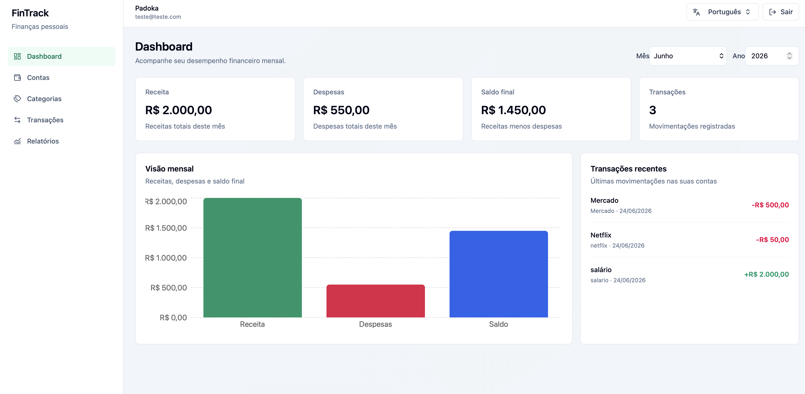

# FinTrack Web

Frontend da FinTrack, uma aplicação de gestão financeira pessoal criada com React e TypeScript. O projeto consome a FinTrack API e oferece uma interface para autenticação, gerenciamento de contas, categorias, transações e acompanhamento do resumo financeiro mensal.

Este repositório faz parte de um projeto full stack pensado para portfólio, com foco em boas práticas, organização por funcionalidades, experiência de usuário clara e integração com uma API REST real.

## Preview



## Funcionalidades

- Cadastro de usuário
- Login com autenticação via JWT
- Dashboard com visão mensal
- CRUD de contas financeiras
- CRUD de categorias
- CRUD de transações
- Filtros de transações por mês, ano, tipo e categoria
- Relatório mensal com receitas, despesas e saldo final
- Estados de loading, erro e empty state
- Layout autenticado com menu lateral
- Integração com backend ASP.NET Core

## Stack

- React
- TypeScript
- Vite
- React Router
- TanStack Query
- React Hook Form
- Zod
- Axios
- Tailwind CSS
- Recharts
- Lucide React
- ESLint

## Arquitetura do frontend

O projeto foi organizado por responsabilidade, mantendo a aplicação fácil de crescer sem virar uma estrutura exagerada.

```text
src/
  app/
    providers.tsx
    routes.tsx
  components/
    layout/
    ui/
  features/
    accounts/
    auth/
    categories/
    summaries/
    transactions/
  lib/
    api.ts
    api-error.ts
    auth-storage.ts
    formatters.ts
```

### Principais decisões

- `features/`: agrupa telas, serviços, tipos, schemas e componentes de cada domínio.
- `components/ui/`: componentes reutilizáveis e neutros, como alertas e empty states.
- `components/layout/`: estrutura visual compartilhada, como sidebar, header e layout autenticado.
- `lib/`: integrações e utilitários globais, como Axios, storage de token e formatadores.
- TanStack Query centraliza cache, loading, erro e atualização dos dados vindos da API.
- React Hook Form com Zod mantém os formulários performáticos e validados no frontend.

## Requisitos

Antes de rodar o frontend, você precisa ter instalado:

- Node.js
- npm
- Git
- FinTrack API rodando localmente

Versão utilizada durante o desenvolvimento:

```bash
node --version
npm --version
```

## Integração com a API

Este frontend depende da FinTrack API.

Por padrão, o frontend espera que a API esteja disponível em:

```text
http://localhost:8080/api
```

Se você estiver rodando a API em outra porta, ajuste a variável `VITE_API_BASE_URL`.

## Variáveis de ambiente

Crie um arquivo `.env` na raiz do projeto:

```bash
cp .env.example .env
```

Exemplo:

```env
VITE_API_BASE_URL=http://localhost:8080/api
```

Importante: o arquivo `.env` não deve ser versionado, pois pode conter configurações locais ou sensíveis.

## Como rodar localmente

Clone o repositório:

```bash
git clone https://github.com/Padokazzz/fintrack-web.git
cd fintrack-web
```

Instale as dependências:

```bash
npm install
```

Configure as variáveis de ambiente:

```bash
cp .env.example .env
```

Inicie a aplicação:

```bash
npm run dev
```

Acesse no navegador:

```text
http://localhost:5173
```

## Como rodar com a API

Em outro terminal, suba a FinTrack API.

Exemplo usando Docker no repositório do backend:

```bash
docker compose up --build
```

Depois, confirme se o Swagger da API está disponível:

```text
http://localhost:8080/swagger
```

Com a API rodando, volte ao frontend e acesse:

```text
http://localhost:5173
```

## Scripts disponíveis

Rodar em desenvolvimento:

```bash
npm run dev
```

Gerar build de produção:

```bash
npm run build
```

Executar lint:

```bash
npm run lint
```

Pré-visualizar build local:

```bash
npm run preview
```

## Fluxo principal da aplicação

1. O usuário cria uma conta ou faz login.
2. O token JWT é salvo localmente.
3. O Axios envia o token nas chamadas autenticadas.
4. O usuário cadastra contas financeiras.
5. O usuário cadastra categorias de receita e despesa.
6. O usuário registra transações vinculadas a uma conta e categoria.
7. O dashboard e o relatório mensal exibem o resumo financeiro.

## Validações

Os formulários usam Zod integrado ao React Hook Form.

Exemplos de validação:

- Email obrigatório e válido
- Senha obrigatória
- Nome obrigatório
- Valor da transação maior que zero
- Conta obrigatória para transações
- Categoria obrigatória para transações
- Tipo de transação compatível com categoria

## Tratamento de erros

A aplicação possui tratamento visual para:

- Erro de login
- Erro de cadastro
- Falha ao carregar dados
- Falha ao criar, editar ou remover registros
- Sessão expirada ou token inválido
- Listas vazias

Quando a API retorna `401 Unauthorized`, o token local é removido e o usuário é redirecionado para o login.

## Build

Para validar se o projeto está pronto para produção:

```bash
npm run lint
npm run build
```

Observação: dependendo do tamanho das dependências, o Vite pode exibir um aviso sobre chunks maiores que 500 kB. Isso não impede o build. Uma melhoria futura é aplicar code splitting com `lazy` e `Suspense`.

## Roadmap

- Adicionar testes de componentes
- Adicionar testes de integração com mocks de API
- Aplicar lazy loading nas rotas
- Adicionar tela de perfil do usuário
- Melhorar responsividade mobile do menu lateral
- Adicionar gráficos por categoria
- Criar Dockerfile para o frontend
- Publicar em ambiente cloud

## Repositórios relacionados

- Backend: `fintrack-api`
- Frontend: `fintrack-web`

## Autor

Desenvolvido por Leonardo como projeto full stack para estudo, prática profissional e portfólio.
